# AI Agent UI

AI Agent UI is a lightweight, user-friendly platform that enables users to configure and manage AI agents with ease. Supporting diverse roles and integrating open-source AI models, it provides a flexible environment for creating personalized AI experiences. Through intuitive workflows, users can select models, define system prompts, set user inputs, and adjust response parameters like temperature, all while enabling real-time streaming of responses.

The platform also allows users to extend the functionality of their AI agents by adding external tools, such as fetching weather data, making it a versatile solution for a wide range of use cases. With its split-layout design, **AI Agent UI** ensures a seamless user experience for both configuring agents and displaying real-time responses.

**AI Agent UI** goes beyond basic interactions, with plans to include advanced features like customizable **AI Roles** to define specialized agent behaviors (e.g., Assistant, Researcher) and a dedicated **AI Tools Page** to manage integrated tools. These features are in active development to further enhance the platform’s capabilities.

Designed with flexibility in mind, **AI Agent UI** is the ideal tool for users looking to build, test, and manage diverse AI agents, all while leveraging powerful open-source AI models and tools.

## Features (Ongoing Development)

- **Model Selection**: Choose an AI model from available options.
- **System Prompt Management**: Use predefined or custom system prompts.
- **User Prompt**: Define a user prompt for interaction.
- **Tools Management**: Add tools to the agent configuration and search for tools.
- **Streaming Responses**: Enable or disable streaming of AI agent responses.
- **Prompt Saving**: Save system prompts to local storage for reuse.
- **Tool Interaction**: Select and add tools for the agent to use.
- **UI Layout**: Split layout for agent configuration and result display.

## New Features

- **AI Roles Page**: A new page where users can manage and configure AI roles. AI roles help define the behavior of the agent. Users can view, add, edit, and delete roles.
- **AI Tools Page**: A new page for users to configure and manage a list of available tools. Currently, a tool for "Getting Current Weather" is implemented as an example, but additional tools can be added. Users can view, add, edit, and delete tools.

  - **Tool Configuration**: Users can add new tools dynamically to the agent's configuration. Tools are stored and managed separately in local storage.

    - **Function Tool**: Users can create tools that perform specific functions or calculations. These tools can be configured to take inputs and return results based on the defined logic.

    - **REST API Tool**: Users can integrate any REST API as a tool for the AI agent. This allows the agent to fetch data or perform actions using external APIs, enhancing its capabilities. Users can configure API endpoints, request methods, headers, and parameters to tailor the API interactions to their needs.

    ### Import API from Swagger Config JSON

    Users can import API configurations from a Swagger JSON file. This feature allows users to select any GET API from the Swagger documentation and add it to the tools.

    #### Steps to Import API

    1. **Upload Swagger JSON**: Users can upload a Swagger JSON file that contains the API documentation.
    2. **Select GET API**: From the uploaded Swagger file, users can browse and select any available GET API.
    3. **Configure API Tool**: Once selected, users can configure the API tool by setting the endpoint, request method, headers, and parameters.
    4. **Add to Tools**: After configuration, the API tool can be added to the list of available tools for the AI agent.

    This feature simplifies the process of integrating external APIs, making it easier for users to enhance the functionality of their AI agents with minimal effort.

    ## Multi Agent Management

- **Multiple Agents Management**: Users can create multiple agents and view the list of available agents in the Agent list view. Users can view, add, edit, and delete agents.

### Benefits and Critical Usage of AI with Different Roles and Tool Support

#### Benefits

1. **Personalization**: By defining different AI roles, users can tailor the behavior and responses of AI agents to specific needs, such as an assistant, researcher, or advisor.
2. **Efficiency**: Specialized roles allow AI agents to perform tasks more efficiently by focusing on specific functions and contexts.
3. **Scalability**: Managing multiple agents with distinct roles enables users to scale their AI operations, handling various tasks simultaneously.
4. **Enhanced Capabilities**: Integrating tools with AI agents extends their functionality, allowing them to perform complex tasks like fetching data from APIs or executing specific functions.

#### Critical Usage

1. **Research and Analysis**: AI agents with a "Researcher" role can gather and analyze data from various sources, providing insights and summaries.
2. **Customer Support**: An AI agent with an "Assistant" role can handle customer queries, provide information, and perform actions like booking appointments.
3. **Data Integration**: Using tools like REST API integration, AI agents can fetch real-time data (e.g., weather information) and use it to provide accurate responses.
4. **Automation**: AI agents can automate repetitive tasks, such as data entry or report generation, improving productivity and reducing human error.

By leveraging different roles and tool support, users can create versatile and powerful AI agents tailored to their specific requirements.

## Installation

### 1. Clone the Repository

```bash
git clone https://github.com/sadaigm/ai-as-agent.git
```

### 2. Install Dependencies

Navigate to the project directory and install the required dependencies:

```bash
cd ai-as-agent
npm install
```

### 3. Run the Development Server

Start the development server with Vite:

```bash
npm run dev
```

This will start the Vite development server, and you can view the application at `http://localhost:5173`.

### 4. Build for Production

To build the project for production, use the following command:

```bash
npm run build
```

This will create a `dist` folder with the production-ready files.

### 5. Preview the Production Build

After building the app, you can preview it locally:

```bash
npm run preview
```

## File Structure

- `src/`: Main source code folder.
  - `components/`: UI components, including the `AIAgentUI` component.
  - `hooks/`: Custom React hooks such as `useSubmitHandler` and `useModels`.
  - `utils/`: Utility functions like `getSystemPromptTemplates`, `getTools`, and `getFuncParamsString`.
  - `types/`: Type definitions for the tools and system roles.
  - `response/`: Components to handle markdown and code rendering.
  - `aiagent.css`: Styling for the AI agent UI.
  - `pages/`: New pages for managing AI roles and tools will be placed here.

## Component Overview

### `AIAgentUI`

This is the main component for the AI agent configuration UI. It handles form submission, tool selection, and response display.

- **Left Form Fields**:
  - **Model**: Select an AI model.
  - **System Role**: Define the AI's role.
  - **System Prompt**: Set the system prompt.
  - **User Prompt**: Enter the user's prompt.
  - **Temperature**: Set the response temperature (0 to 1).
  - **Stream**: Enable or disable streaming of responses.
  - **Tools**: Add tools to the agent.

- **Right Panel**: Displays the results of the agent's response in markdown format.

## AI Roles and AI Tools Pages

### AI Roles

A new **AI Roles** page will be created, allowing users to configure different AI roles. Roles help define the behavior and context of the AI agent. Users will be able to create and manage multiple roles.

- **Create and Manage AI Roles**: Users can define roles like "Assistant", "Researcher", "Advisor", etc.
- **Save Roles**: Roles will be saved to local storage for easy reuse.

### AI Tools

A new **AI Tools** page will allow users to manage a list of tools available for the AI agent to use. Currently, we have an example tool for "Getting Current Weather".

- **Add More Tools**: Users will be able to add additional tools in the future. Tools are managed separately in local storage.
- **Tool Configuration**: Each tool can have a description and specific configuration to integrate with the AI agent.

## Example Tool Implementation

As an example, a tool for getting the current weather has been implemented. This is just one of the many tools that can be added in the future.

- **Current Weather Tool**: Fetches weather information based on user input and returns it to the AI agent.

## Screenshots

- **AI Agents ListView**:
  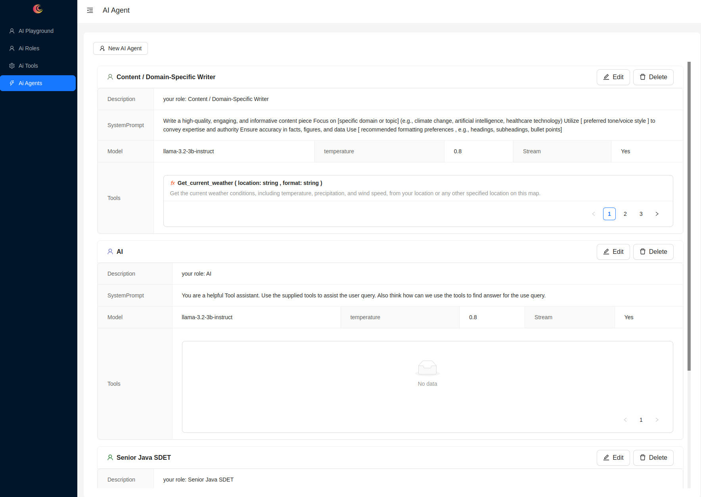
  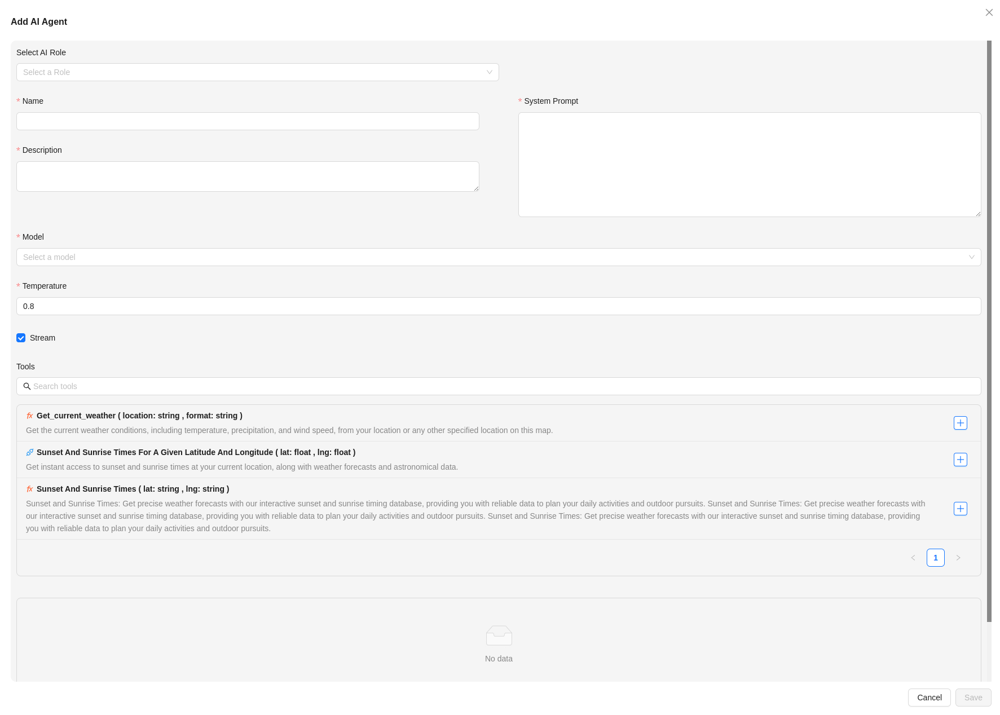
  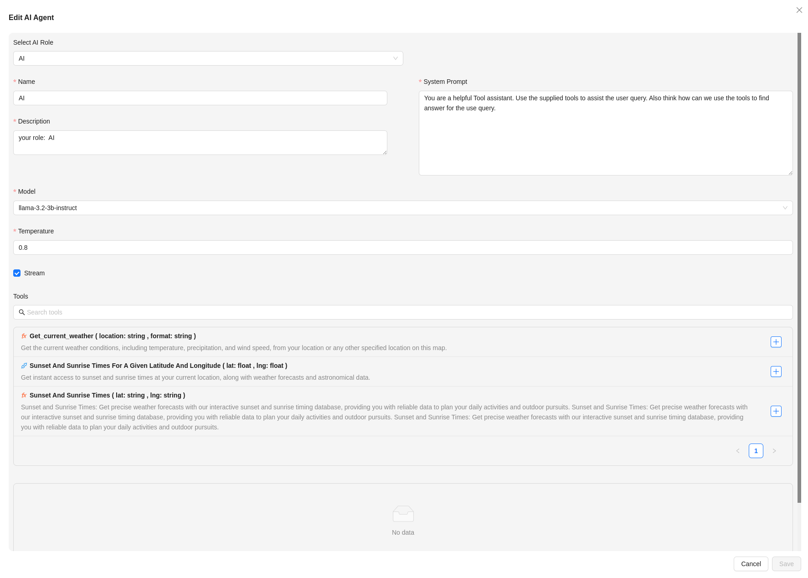
  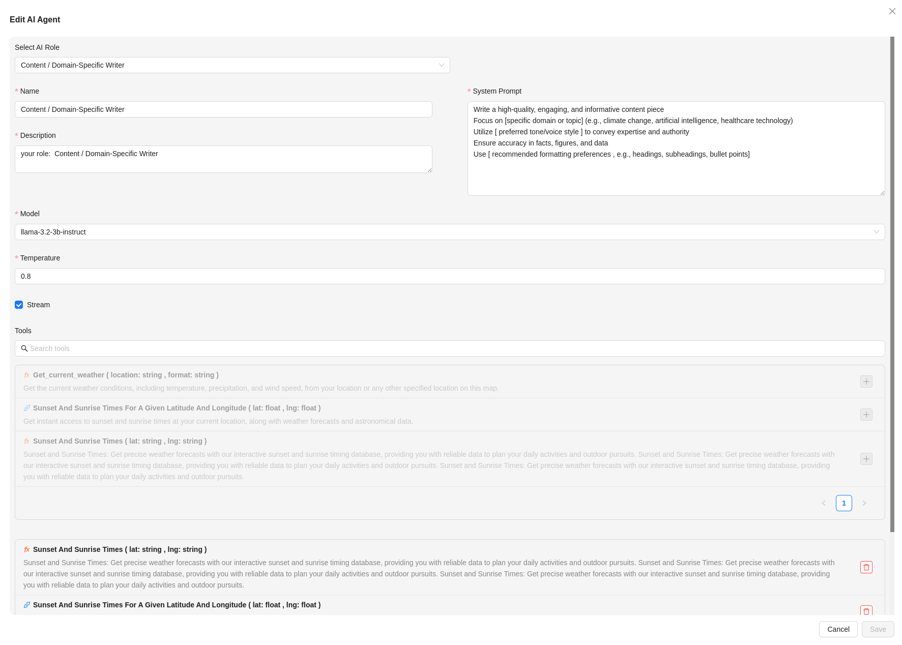  
  

- **AI Playground**: 
  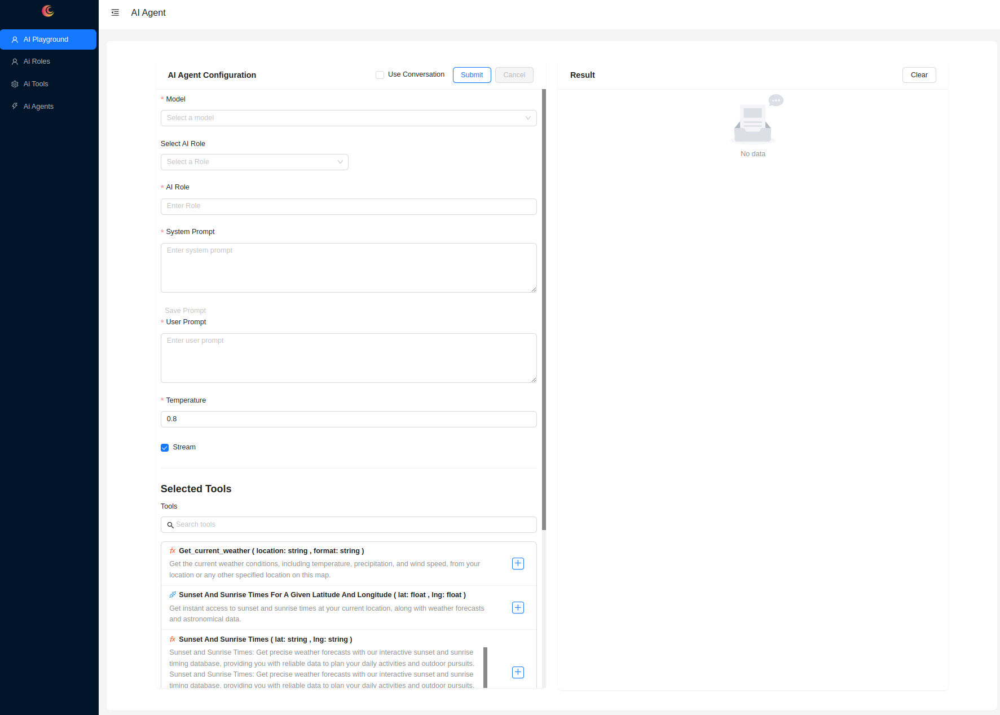
  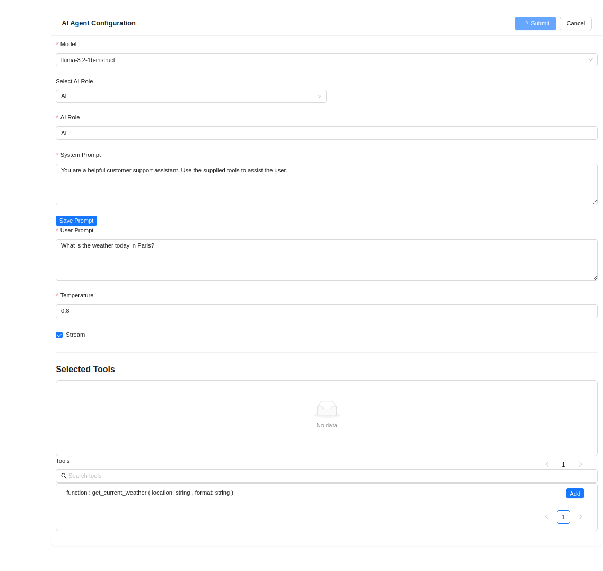

- **Response Panel**: 
  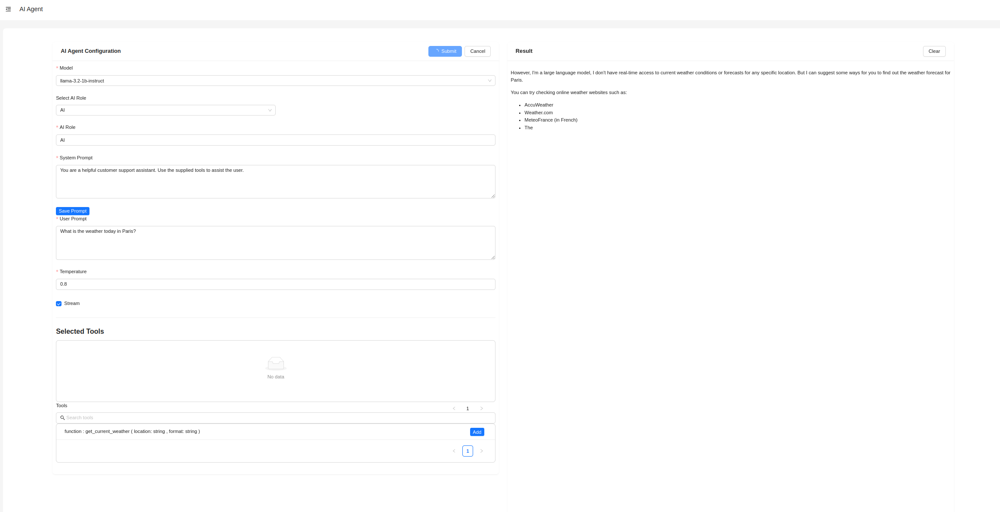
  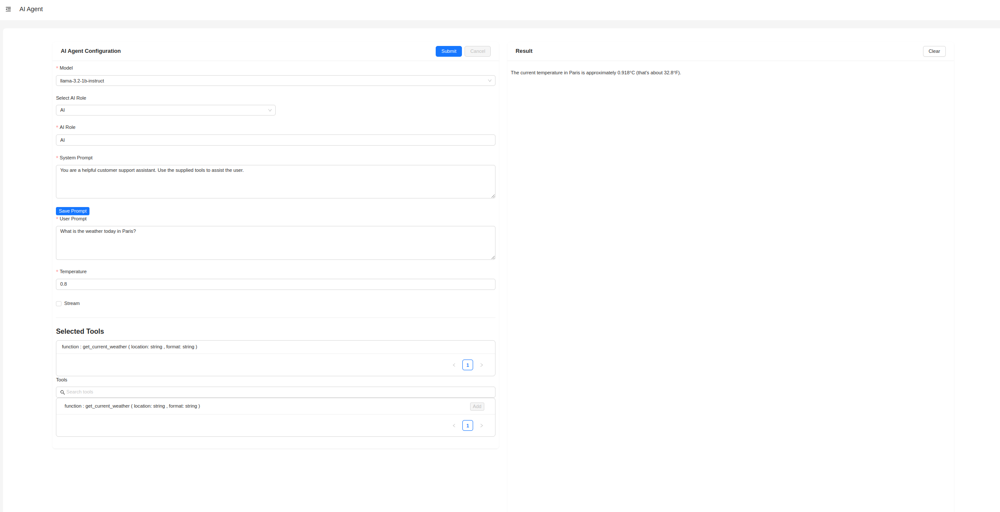

- **Agent Persona**: 
  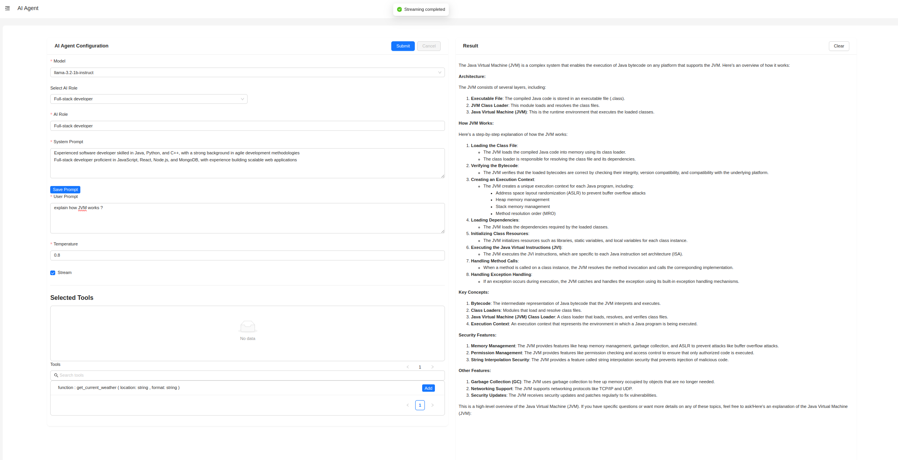
  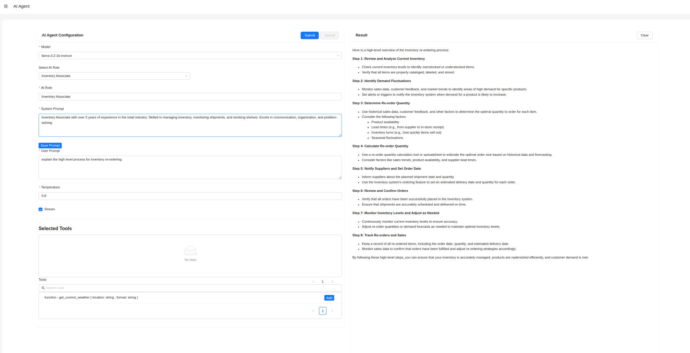
  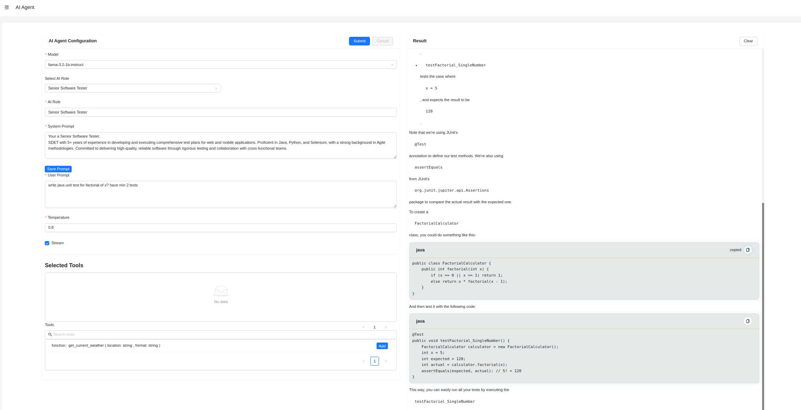
  

- **Agent Tools Support**: 
  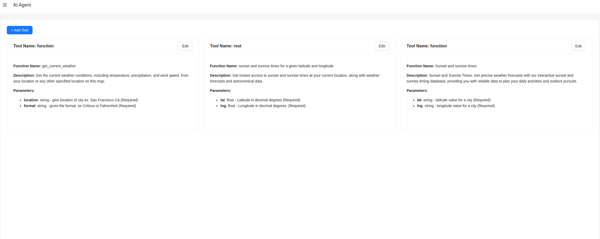
  
  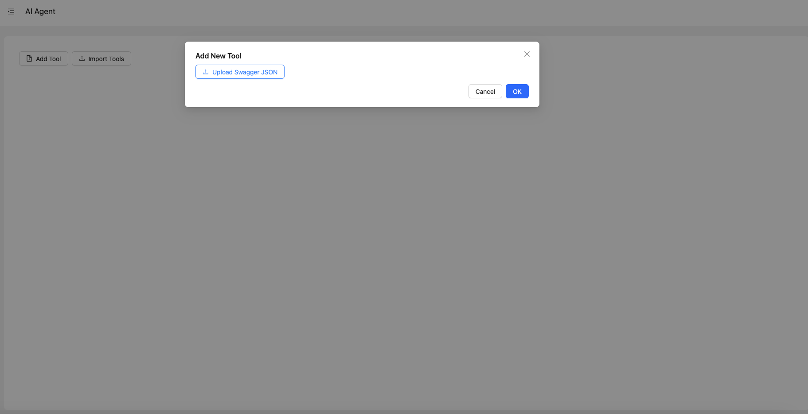
  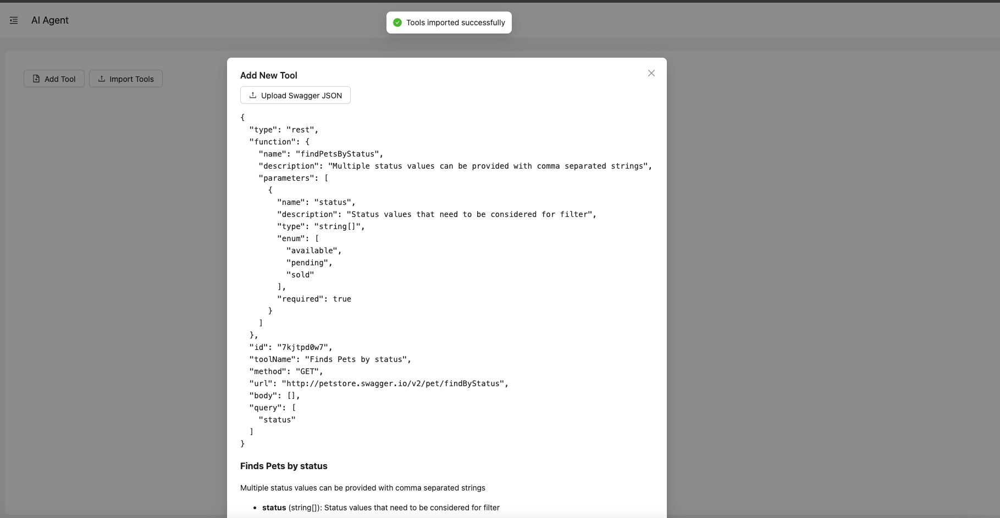
  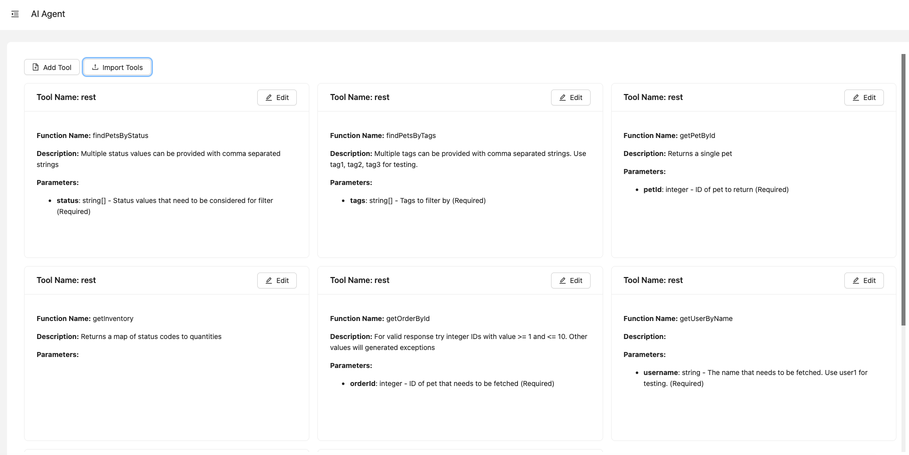


## Dependencies

- **React**: 18.x
- **Ant Design**: 4.x
- **Vite**: 4.x (bundler and development server)
- **React Markdown**: For rendering markdown responses.
- **@ant-design/icons**: For Ant Design icons.

## License

This project is licensed under the MIT License - see the [LICENSE](LICENSE) file for details.

## Acknowledgements

- Ant Design for UI components.
- React Markdown for rendering markdown responses.
- Vite for fast bundling and development server.
